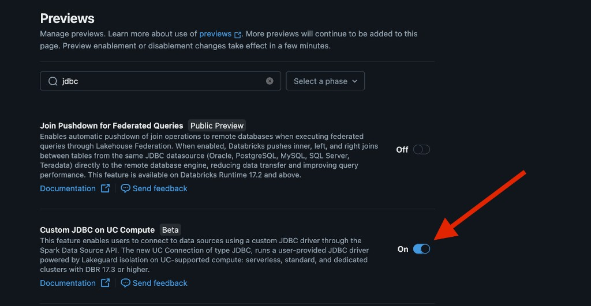
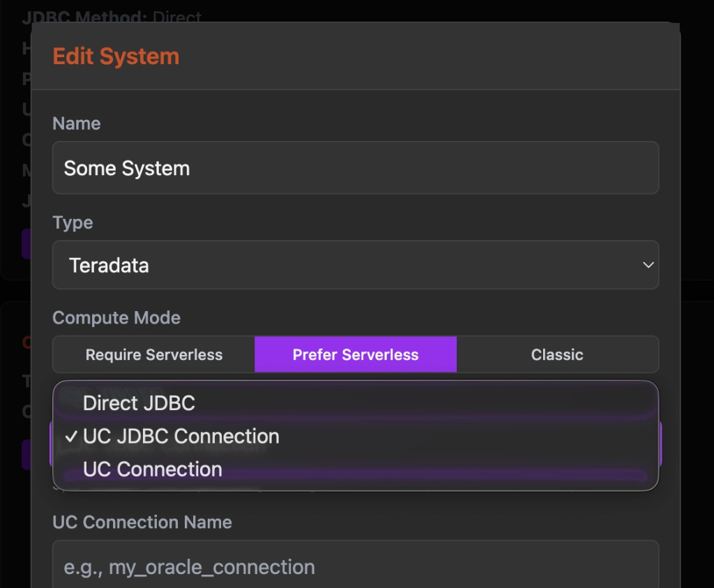

# Upgrade Guide: Serverless Support & Direct Deploy Engine

This guide walks you through upgrading an existing LiveValidator deployment to support serverless compute, test connections, and the new Databricks direct deployment engine.

**Time estimate:** ~15 minutes

---

## Prerequisites

- Databricks CLI **v0.287.0+** (required for `catalogs` resource support)
  ```bash
  databricks --version  # check current
  brew upgrade databricks  # or your install method
  ```
- **Custom JDBC on UC Compute** preview enabled in your workspace. Go to **Admin Settings → Previews**, search for "jdbc", and enable **Custom JDBC on UC Compute**. This is required for `uc_jdbc_connection` to work on serverless and standard clusters (DBR 17.3+).



---

## Step 1: Update `databricks.yml`

Apply the following changes to your `databricks.yml`. Reference `databricks.yml.example` for the full file.

### 1a. Add `engine: direct` under `bundle`

```yaml
bundle:
  name: LiveValidator
  engine: direct
```

### 1b. Add the `variables` block (below `workspace`)

```yaml
variables:
  serverless_version:
    description: The serverless environment version
    default: 5
```

### 1c. Add new job resources to the `apps.live_validator.resources` list

Add these alongside the existing `run-validation` and `fetch-lineage` entries:

```yaml
        - name: run-validation-serverless
          job:
            id: ${resources.jobs.run_validation_serverless.id}
            permission: 'CAN_MANAGE_RUN'
        - name: test-connection
          job:
            id: ${resources.jobs.test_connection.id}
            permission: 'CAN_MANAGE_RUN'
        - name: test-connection-serverless
          job:
            id: ${resources.jobs.test_connection_serverless.id}
            permission: 'CAN_MANAGE_RUN'
```

### 1d. Add `catalogs` and `schemas` under `resources`

Place after the `clusters` block:

```yaml
  catalogs:
    live_validator_data:
      name: live_validator_data
      comment: "Store LiveValidator information as Delta"
      grants:
        - principal: account users
          privileges:
            - USE CATALOG
            - SELECT
  schemas:
    entities:
      name: entities
      catalog_name: ${resources.catalogs.live_validator_data.name}
      comment: "Store point-in-time entity data"
```

> **Note:** Privileges use SQL syntax with spaces (`USE CATALOG`), not underscores.

---

## Step 2: Migrate from Terraform to Direct Deploy

The direct engine uses a different state file than Terraform. **Existing deployments must migrate their state before the first direct deploy.**

### For existing deployments (you've deployed before)

**2a.** Temporarily comment out the `catalogs` and `schemas` blocks you added in Step 1d.

**2b.** Deploy with the existing Terraform engine (syncs all other changes):

```bash
databricks bundle deploy -t <your-target>
```

**2c.** Migrate the state to the direct engine:

```bash
databricks bundle deployment migrate -t <your-target> --noplancheck
```

**2d.** Verify — this should show no changes (or zero deletes):

```bash
databricks bundle plan -t <your-target>
```

**2e.** Uncomment the `catalogs` and `schemas` blocks from Step 1d, then deploy again:

```bash
databricks bundle deploy -t <your-target>
```

### For new deployments (first time deploying)

No migration needed. The `engine: direct` setting handles everything automatically.

---

## Step 3: Deploy

```bash
databricks bundle deploy -t <your-target>
```

Then deploy the app:

```bash
databricks apps deploy live-validator -t <your-target>
```

---

## Step 4: Restart JobSentinel

The `JobSentinel` job now selects between classic and serverless validation jobs based on each system's compute mode. You must restart it to pick up the new logic.

1. In the Databricks workspace, navigate to **Workflows → Jobs** and find the `JobSentinel` job.
2. **Cancel** any active run.
3. **Run** the job again — it will pick up the updated notebook automatically.

> If you use a scheduled trigger, no action is needed beyond cancelling the current run; the next scheduled run will use the new code.

---

## Step 5: Configure Systems

Open each system in the LiveValidator UI and configure the new serverless settings.



| Setting | Options | Description |
|---|---|---|
| **Compute Mode** | **Require Serverless** | All validations involving this system run on serverless only. Will fail if paired with a classic system. |
| | **Prefer Serverless** | Uses serverless when available; falls back to classic if the other system requires classic. Test Connection will probe both. |
| | **Classic** | Always uses a classic cluster. Will fail if paired with a serverless system. |
| **JDBC Method** | **Direct JDBC** | (Classic only) Connects using a raw JDBC URL with driver, host, port, and credentials stored in Databricks secrets. Use when UC does not manage the connection. |
| | **UC JDBC Connection** | Uses a Unity Catalog JDBC connection object. Requires the **Custom JDBC on UC Compute** preview. Specify the connection name in **UC Connection Name**. Works on serverless or classic.|
| | **UC Connection** | Uses Unity Catalog Query Federation (`spark.sql` with the connection). Works on serverless or classic. |

After updating each system, click **Apply**, then **Test Connection** to verify connectivity with the new settings.

---

## Step 6: Verify

Run a few validations with your new settings! Reach out to Dan Z if you have an issues.

---

## Troubleshooting

| Symptom | Fix |
|---|---|
| `unknown field: catalogs` | CLI version too old. Upgrade to v0.287.0+ |
| `unknown field: engine` | CLI version too old. Upgrade to v0.287.0+ |
| `Catalog resources are only supported with direct deployment mode` | State still uses Terraform. Run the migration (Step 2) |
| `does not match the existing state (engine "terraform")` | Migration hasn't completed. Re-run Step 2 |
| Plan check fails during migrate | Comment out `catalogs`/`schemas`, migrate, then uncomment |
